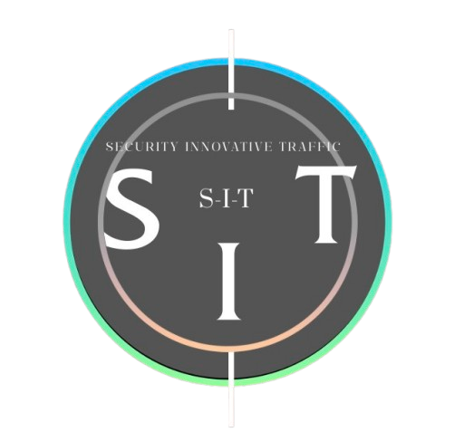
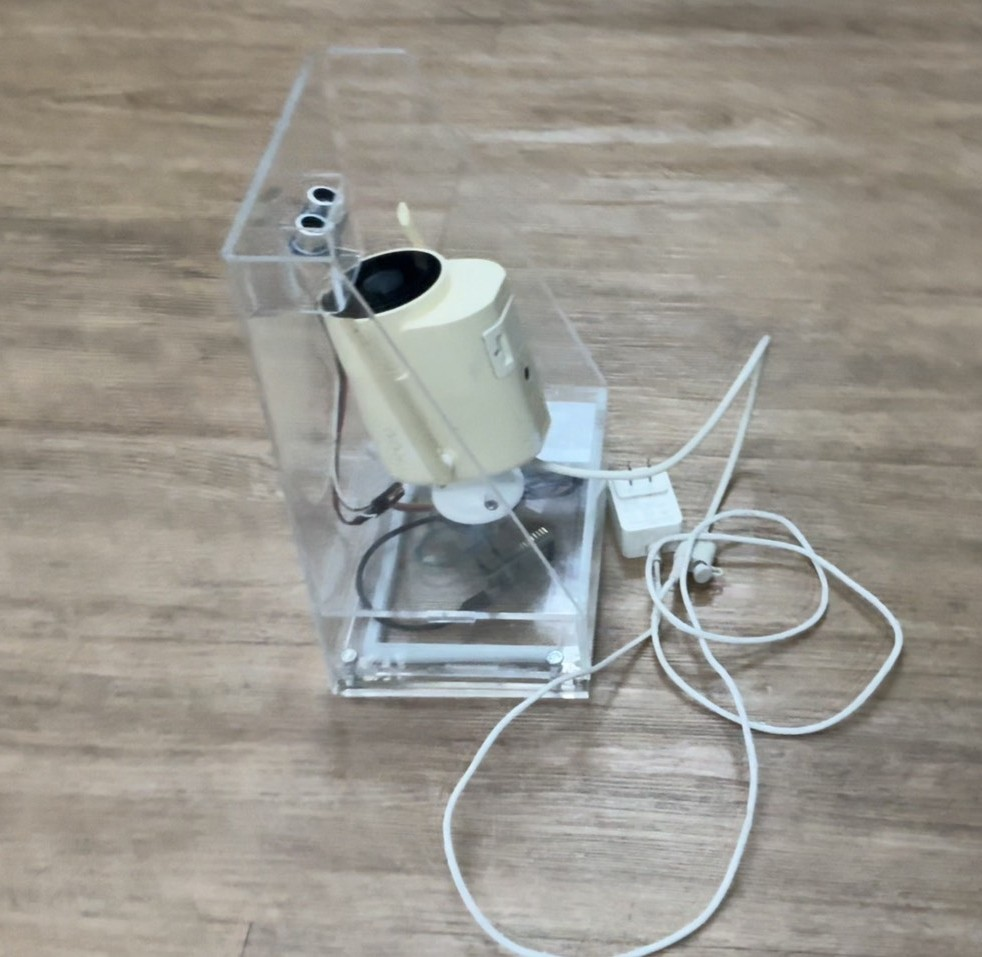

<!DOCTYPE html>
<html lang="th">
<head>
  <meta charset="UTF-8">
  <title>S.I.T.Company</title>
  <meta name="viewport" content="width=device-width, initial-scale=1.0">

  
</head>

<body>

<header>
  

    
    <h1>S.I.T.Company</h1>
  

</header>

<nav>
  <a href="#home">หน้าแรก</a>
  <a href="#product">สินค้า</a>
  <a href="#contact">ติดต่อเรา</a>
</nav>

<section class="hero" id="home">
  <h2>เทคโนโลยีความปลอดภัยเพื่อคุณภาพและอนาคต</h2>
  
นวัตกรรมเพื่อความปลอดภัย

</section>

<section class="product" id="product">
  <h2>สินค้าแนะนำ</h2>

  

  

    กล้องวงจรปิดสำหรับการจัดการจราจร 
    ติดตั้งง่าย ปลอดภัย และใช้งานสะดวก
  

  
฿21,999

</section>

<section id="contact" style="text-align:center; padding:20px;">
  📞 โทร: 080-085-0053 | 📧 Email: S.I.T.Company@email.com
</section>

<footer>
  © 2026 S.I.T.Company | All Rights Reserved
</footer>

</body>
</html>
